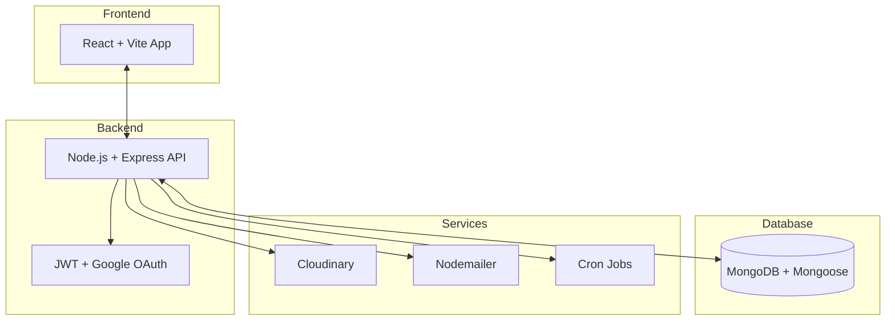

# 🏥 CureLink

<p align="center">
  
</p>

> **A Full-Stack Healthcare Platform for Seamless Patient & Doctor Workflows** 🚀

CureLink is a production-ready healthcare web application designed to streamline **patient onboarding, appointment management, consultations, and prescription workflows**.

It combines modern frontend UX with a secure backend architecture to deliver a **scalable, real-world medical platform**.

---

## ✨ Core Features

### 🧑‍⚕️ 1. Patient Management

* Secure onboarding & profile management
* Authentication with **JWT + Google OAuth**
* Cookie-based session handling

### 📅 2. Appointment System

* Book, manage, and track appointments
* Structured scheduling workflow
* Real-time status updates

### 📝 3. Consultation Tracking

* Maintain consultation history
* Structured patient-doctor interactions
* Persistent records for future reference

### 💊 4. Prescription Workflow

* Digital prescription management
* Cloud-based storage using **Cloudinary**
* Easy access & retrieval

### 📧 5. Notifications & Automation

* Email notifications via **Nodemailer**
* Background jobs using **Cron**
* Automated workflows for reminders

---

## 🏗️ Architecture Overview



---

## 🛠️ Tech Stack

### ⚡ Frontend

* React 19
* Vite
* React Router
* Axios
* Tailwind CSS

### 🔌 Backend

* Node.js
* Express.js
* MongoDB + Mongoose
* JWT Authentication (Cookies)
* Passport Google OAuth
* Nodemailer
* Cloudinary
* Node Cron

---

## 📂 Project Structure

```bash
CureLink/
│
├── frontend/      # React + Vite Client
├── server/        # Express API Server
└── README.md
```

---

## 🚀 Getting Started

### 📦 1. Clone Repository

```bash
git clone https://github.com/your-username/curelink.git
cd curelink
```

---

### 📥 2. Install Dependencies

```bash
# Frontend
cd frontend
npm install

# Backend
cd ../server
npm install
```

---

### ⚙️ 3. Environment Setup

Create:

```bash
server/config/.env
```

```env
MONGO_DB_URL=
PORT=5000

JWT_SECRET=
JWT_RESET_SECRET=

NODE_ENV=development

GOOGLE_CLIENT_ID=
GOOGLE_CLIENT_SECRET=
GOOGLE_CALLBACK_URI=

FRONTEND_URI=

CLOUD_NAME=
CLOUD_API_KEY=
CLOUD_API_SECRET=

USER=
APP_PASSWORD=
```

> ⚠️ Never commit `.env` files

---

### ▶️ 4. Run Locally

```bash
# Backend
cd server
npm run dev

# Frontend
cd frontend
npm run dev
```

---

## 🌐 API Configuration

* **Base URL:** `http://localhost:5000`
* **Namespace:** `/api/v1`

---

## 📜 Scripts

### Frontend

```bash
npm run dev       # Start dev server
npm run build     # Production build
npm run preview   # Preview build
npm run lint      # Lint code
```

### Backend

```bash
npm run dev       # Run with nodemon
```

---

## 🚀 Deployment Strategy

* Deploy frontend & backend separately
* Enable HTTPS (mandatory for auth cookies)
* Configure secure CORS policies
* Use:

  * MongoDB Atlas (DB)
  * Cloudinary (media)
  * Render / VPS / Docker (hosting)

### Recommended Additions

* PM2 (process manager)
* Logging (Winston / Pino)
* Monitoring (Sentry)

---

## 🔐 Security Practices

* HTTP-only secure cookies
* JWT-based authentication
* OAuth integration
* Environment variable isolation
* Credential rotation before production

---

## 📈 Future Enhancements

* 👨‍⚕️ Role-based dashboards (Doctor/Admin/Patient)
* 💬 Real-time chat & video consultations
* 🤖 AI-based diagnosis assistant
* 📊 Analytics & reporting dashboard
* 📱 Mobile-first responsive upgrade

---
